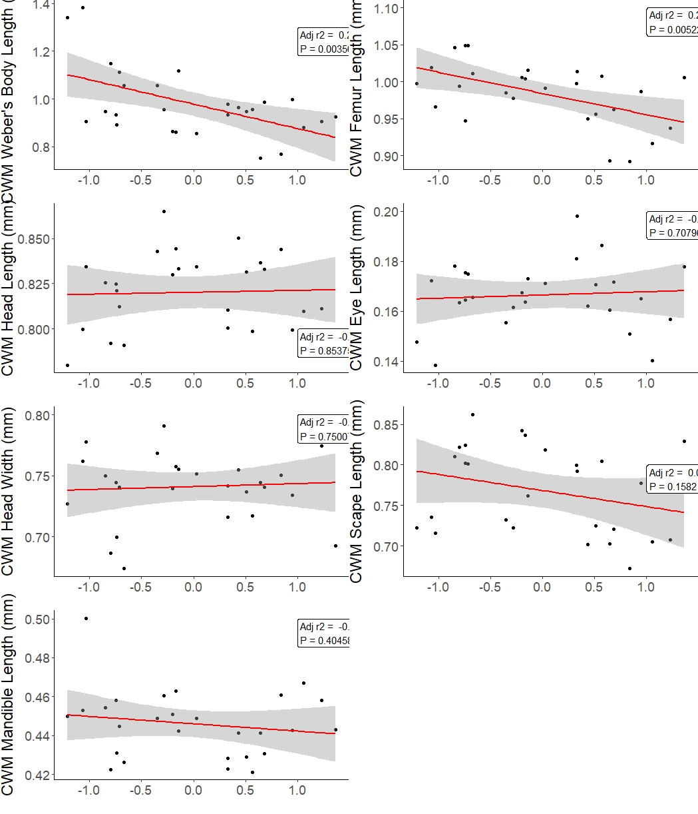

```{r setup, error = FALSE, warning = FALSE, message = FALSE, results = "hide"}
library(dplyr)
library(tidyr)
library(ggplot2)
library(performance)
library(glmmTMB)
library(vegan)
library(ggvegan)
library(FD)
library(picante)
library(purrr)
library(gridExtra)
```

### Functions

```{r}


multiple.func <- function(x) {
      c(mean = mean(x), sd = sd(x))
}
```
# Data Cleaning

```{r}

#see Cleaning.R in scripts folder for data cleaning
wide <- read.csv("Clean Data/ants_wide.csv")
cov <- read.csv("Clean Data/ants.csv")
site_data <- read.csv("Clean Data/sites_joined.csv")
cov <- right_join(site_data, cov, by = c("Site", "month"))

cov <- dplyr::select(cov, 3:10, 14:19, 22:36, 39:41)

#total count of ants
sum(cov$abun)

#add ecostress sensor data
eco <- read.csv("Clean Data/ecostress.csv")
eco <- select(eco, 1, 2, 11)
eco <- rename(eco, month = Category, Site = ID, esi = ECO4ESIPTJPL_001_Evaporative_Stress_Index_PT_JPL_ESIavg)
cov <- right_join(eco, cov, by = c("Site", "month"))

#read in foundation plant identity for the sites
shrubs <- read.csv("Clean Data/shrubs.csv")
cov <- right_join(cov, shrubs, by = "Site")
cov$shrub.site <- as.factor(cov$shrub.site)


#read in ndvi and soil data
ndvi <- read.csv("raw data/sites_remotesensing.csv")
ndvi <- select(ndvi, 7:17) %>%
  rename(Site = site)
ndvi$Site <- gsub("MoV", "Mov", ndvi$Site)
cov <- right_join(cov, ndvi, by = c("Site", "month"))
cov$sites <- paste(cov$Site, cov$month)
```


```{r}

#cleaning the raw trait data
traits <- read.csv("raw data/Traits.csv")

#check for spelling mistakes in trait labels
unique(traits$Trait)
#I don't trust the eye width measurements because they were measured from the front
traits <- filter(traits, Trait != "Eye width")
#unique(traits$Photo)

#extract site IDs from photo names
traits <- separate(traits, Photo, c("Site", "Slide", "Specimen"))
traits$Site <- gsub("Papl", "PaPl", traits$Site)
unique(traits$Site)
traits <- traits[-1,]

#remove the double pheidole entry
traits <- traits[-2,]

#need to divide the trait values by weber's body length. I want to do this at the individual level, not dividing means by mean webers
traits <- select(traits, -X, -Label)
traits <- pivot_wider(traits, names_from = Trait, values_from = Measure)
traits <- mutate(traits, Femur.w = Femur/Webers, Scape.w = Scape/Webers, Mandible.w = `Mandible length`/Webers, Headl.w = `Head length`/Webers, Eyel.w = `Eye length`/Webers, Headw.w = `Head width`/Webers)
traits <- pivot_longer(traits, 5:17, names_to = "Trait", values_to = "Measure")

#check for ant species name typoes
unique(traits$X.1)

#some traits are NA because of damage to the specimen
traits <- drop_na(traits)

#calculate the mean value of the trait for each species at each site (population level trait values)
traits.ag <- group_by(traits, Site, X.1, Trait) %>%
  summarise(mean = mean(Measure), sd = sd(Measure))

#create a data frame of the mean values for each species across all sites (species level trait values)
traits.sp <- group_by(traits, X.1, Trait) %>% 
  summarise(mean = mean(Measure), sd = sd(Measure))

```

## Calculations

```{r}
#we could also try to log transform the abundances to reduce the impact of colony size 
#this is presence absence

long.pres <- pivot_longer(wide, 2:14, names_to = "species", values_to = "count")

long.pres <- mutate(long.pres, count.bin = ifelse(count >= 1, 1, 0))

spe.bin <- long.pres
#get total abundance per trap
long.pres <- group_by(long.pres, uniID) %>% 
  mutate(total = sum(count.bin)) 

#calculate relative abundances
long.pres <- long.pres %>% mutate(rel.abun = count.bin/total)

traits.ag <- rename(traits.ag, species = X.1)
traits.ag$species <- gsub(" ", "", traits.ag$species)

#add sites to long
long.pres <- cov %>% select(Site, uniID) %>% right_join(long.pres, . , by = 'uniID')
#this adds NA traits to 0 abundances - species isn't found at pitfall or site

  
join.right <- right_join(traits.ag, long.pres, by = c("Site", "species"))

CWM.pres <- mutate(join.right, cwm.prod = mean*rel.abun)

CWM.pres <- group_by(CWM.pres, Site, uniID, Trait) %>% summarise(cwm = sum(cwm.prod))

#join environmental data to CWM trait dataframe

CWM.pres <- left_join(CWM.pres, cov, by = "uniID")

```

```{r}
#make a presence/absence pitfall trap data frame

spe.bin <- select(spe.bin, 2, 3, 5)
spe.bin <- pivot_wider(spe.bin, names_from = species, values_from = count.bin)
spe.bin <- select(spe.bin, -11, -12)
```

# EDA

## Heat Map

```{r}

mat <- pivot_wider(CWM.pres, names_from = Trait, values_from = cwm)
mat <- select(mat, 5:11, 14:17, 25:29, 31, 38:44, 46, 48, 51, 52, 54, 55, 57) %>% ungroup()
mat <- ungroup(mat) %>% select(-uniID)
mat <- drop_na(mat)
#str(mat)
M <- cor(mat)
corrplot::corrplot(M, method = "number")

```


# PCA for traits

## Invidividuals

```{r}
# I want the PCA on traits
# make it wide again

traits.wide <- pivot_wider(traits, names_from = Trait, values_from = Measure)
#keep only weber lengthh standardized traits
traits.wide <- select(traits.wide, 11:17)
traits.wide <- drop_na(traits.wide)

traits.st <- decostand(traits.wide, method = "standardize")
traits.pca <- rda(traits.st)

#summary(traits.pca)
autoplot(traits.pca, xlab = "PCA 33.9%", ylab = "PCA 32.9%")
#PC3 is ~15%

```


## Populations

```{r}

trait.pop <- traits.ag
trait.pop$spepop <- paste(trait.pop$species, trait.pop$Site)
trait.pop <- ungroup(trait.pop) %>% select(spepop, Trait, mean)
trait.pop <- pivot_wider(trait.pop, names_from = Trait, values_from = mean)
trait.pop <- select(trait.pop, 1, 3, 5, 8, 9, 11, 13, 14)

trait.pop.st <- select(trait.pop, -1) %>% decostand(method = "standardize")
trait.pop.pca <- rda(trait.pop.st)
#summary(trait.pop.pca)
autoplot(trait.pop.pca, xlab = "PCA 35.8%", ylab = "PCA 32.2 %")
#PCA3 ~ 16%
```

## Sites - pitfall traps

```{r}

env <- select(cov, 4:9, 12:14, 23:27, 29, 37:43, uniID) %>% drop_na()
env_sitelabels <- env$uniID
env <- select(env, -uniID)

#standardize to mean of zero etc

env.d <- decostand(env, method = "standardize")
env.pca <- rda(env.d)
    
a <- summary(env.pca)
b <- a$cont$importance
prop1 <- b[2,1] * 100 
prop1 <- round(prop1, digits = 2)
prop2 <- b[2,2] * 100
prop2 <- round(prop2, digits = 2)

autoplot(env.pca, xlab = paste("PCA", prop1), ylab = paste("PCA", prop2))
score2 <- scores(env.pca, c(1,2, 3), 'sites')
score2 <- as.data.frame(cbind(score2, env_sitelabels))
```


## Sites - site-level


```{r}

env2 <- select(cov, 3:5, 8, 12:15, 37:43, sites) %>% drop_na() %>% distinct()
env2_sitelabels <- env2$sites
env2 <- select(env2, -sites)

#standardize to mean of zero etc

env.d2 <- decostand(env2, method = "standardize")
env.pca2 <- rda(env.d2)

a <- summary(env.pca2)
b <- a$cont$importance
prop1 <- b[2,1] * 100 
prop1 <- round(prop1, digits = 2)
prop2 <- b[2,2] * 100
prop2 <- round(prop2, digits = 2)    
#summary(env.pca2)
autoplot(env.pca2, xlab = paste("PCA", prop1), ylab = paste("PCA", prop2))
#sitescores <- scores(env.pca2, c(1,2, 3), 'sites')


envreduce <- select(env2, -esi, -arid, -10, -12, -13, -14)

env.reduce <- decostand(envreduce, method = "standardize")
env.pcareduce <- rda(env.reduce)
a <- summary(env.pcareduce)

b <- a$cont$importance
prop1 <- b[2,1] * 100 
prop1 <- round(prop1, digits = 2)
prop2 <- b[2,2] * 100
prop2 <- round(prop2, digits = 2)    
#summary(env.pcareduce)

autoplot(env.pcareduce , xlab = paste("PCA", prop1), ylab = paste("PCA", prop2) )

sitescores <- scores(env.pcareduce, c(1,2, 3), 'sites')
sitescores <- as.data.frame(cbind(sitescores, env2_sitelabels))


```

# Site-level

## Functional dispersion

### more data wrangling
```{r}


#need a species by trait matrix, but I want to use the population means
#make species name the name + site

site.pop <- select(cov, 1, 2, 31) %>% left_join(long.pres, ., by = 'uniID')

#count uniID per site and month
counts <- site.pop %>% group_by(Site.x, month, uniID) %>% count()
counts <- counts %>% group_by(Site.x, month) %>% count()

site.pop <- site.pop %>% group_by(Site.x, month, species) %>% summarize(total = sum(count.bin)) 

site.pop <- left_join(site.pop, counts, by = c("Site.x", "month"))

site.pop <- mutate(site.pop, pit.abun = total/n)
site.pop <- select(site.pop, 1:3, 6)
site.pop$site.name <- paste(site.pop$Site.x, site.pop$month)
site.pop$spepop <- paste(site.pop$species, site.pop$Site.x)
site.pop <- site.pop %>% ungroup() %>% select(4:6)


wide.pop <- pivot_wider(site.pop, names_from = spepop, values_from = pit.abun)
wide.pop[is.na(wide.pop)] <- 0
sites <- wide.pop$site.name

#there are no trait measurements for species that are absent from a site
wide.pop <- ungroup(wide.pop) %>% select(-site.name)
wide.pop <- wide.pop[which(colSums(wide.pop) !=0)]
wide.pop <- cbind(sites, wide.pop)
row.names(wide.pop) <- wide.pop$sites
wide.pop <- select(wide.pop, -sites)

#remove the two solenopsis singletons - no trait measuremnts

wide.pop <- select(wide.pop, -36, -42)

#check to ensure names are matched correctly between dataframes
spec <- colnames(wide.pop)

trait.pop <- as.data.frame(trait.pop)
row.names(trait.pop) <- trait.pop$spepop
trait.pop <- select(trait.pop, -spepop)

all.equal(spec, row.names(trait.pop))

```
## Null model/SES calculation

### Functional dispersion

```{r, echo=FALSE}

#Lets create a matrix to store results from each iteration (one column per iteration)

#saving the randomization as an R object to cut down knit time
# numberReps <- 100
# resultsRandom <- matrix(NA, nrow = nrow(wide.pop), ncol = numberReps,
#                         dimnames = list(rownames(wide.pop),
#                                         paste0("Sim.", 1:numberReps)))
# for(rep in 1:numberReps){
#   randomizedFDis <- randomizeMatrix(samp = wide.pop, null.model = "independentswap")
#   simFDis <- dbFD(trait.pop, randomizedFDis, w.abun = TRUE)$FDis
#   resultsRandom[, rep] <- simFDis
# }


#saveRDS(resultsRandom, file = "Clean Data/objects/FDispRandom_sites.rds")


```


```{r}
resultsRandom <- readRDS("Clean Data/objects/FDispRandom_sites.rds")

obsFDis <- dbFD(trait.pop, wide.pop, w.abun = TRUE)$FDis
meanNull3 <- rowMeans(resultsRandom)
ES3 <- obsFDis - meanNull3
sdNull3 <- apply(resultsRandom, 1, sd)
SES3 <- ES3 / sdNull3
SES_dis <- data.frame(SES3)
SES_dis$sites <- row.names(SES_dis)

#make random values negative
resultsRandom_neg <- resultsRandom * -1
diff <- sweep(resultsRandom_neg, 1, obsFDis, "+")
diff_ses <- sweep(diff, 1, meanNull3, "/")
diff_ses_ag <- apply(diff_ses, 1, multiple.func)
diff_ses_ag <- t(diff_ses_ag)
diff_ses_ag <- cbind(diff_ses_ag, SES_dis$sites)

#get rid of last row
diff_ses_ag <- head(diff_ses_ag, 27)

test <- cbind(sdNull3, diff_ses_ag)
test <- as.data.frame(test)
test$sd <- as.numeric(test$sd)
test <- rename(test, sdrand = sdNull3)
test$sdrand <- as.numeric(test$sdrand)

cor.test(test$sd, test$sdrand)

#variation in SES values is the same as the random variation in fdisp calculated from a null model


#join site-level environmental measurements to data

cov$sites <- paste(cov$Site, cov$month)
SES <- select(cov, 1:15, shrub.site, sites, 37:43) %>% distinct() %>% left_join(SES_dis, by = "sites")

```

## Functional dispersion and PC gradient
```{r}

SES2 <- cbind(SES, sitescores)
SES2$PC1 <- as.numeric(SES2$PC1)
SES2$PC2 <- as.numeric(SES2$PC2)
SES2$PC3 <- as.numeric(SES2$PC3)

#need to add raw FDisp score


mean(SES$SES3)
t.test(SES$SES3)


m1 <- lm(SES3 ~  PC1 + PC2 , data = SES2)
summary(m1)
shapiro.test(resid(m1))
ggplot(SES2, aes(PC1, SES3)) + geom_smooth(method = 'lm')
ggplot(SES2, aes(PC1, SES3, color = shrub.site)) + geom_smooth(method = 'lm')


SES2 <- mutate(SES2, shrub = ifelse(shrub.site == "atriplex", "shrub", (ifelse(shrub.site == "ephedra", "shrub", "open"))))


ggplot(SES2, aes(PC1, SES3, color = shrub)) + geom_smooth(method = 'lm')


ggplot(SES2, aes(PC1,SES3, color = shrub)) + geom_point()
ggplot(SES2, aes(PC1,SES3, color = Site)) + geom_point()


m2 <- lm(SES3 ~ arid, data = SES2)
summary(m2)

ggplot(SES2, aes(arid, SES3)) + geom_smooth(method = 'lm')
ggplot(SES2, aes(Temp, SES3)) + geom_smooth(method = 'lm')
ggplot(SES2, aes(Max, SES3)) + geom_smooth()
ggplot(SES2, aes(NDVI, SES3)) + geom_smooth(method = 'lm')
ggplot(SES2, aes(mean.cover, SES3)) + geom_smooth(method = 'lm')
ggplot(SES2, aes(var.cover, SES3)) + geom_smooth()


#new heat map
mat3 <- select(SES2, esi, 4,5, 8, 12:15, 18, 24, 24:28)
M3 <- cor(mat3)
corrplot::corrplot(M3, method = "number")


```


## Alpha richness ~ PC1

```{r}

#use long pres
#join month by identifier
#remove the two singletons?
#sum presences per site


alpha <- select(cov, uniID, month) %>% right_join(long.pres, by = "uniID")
alpha$sites <- paste(alpha$Site, alpha$month)
alpha <- filter(alpha, species != "Solenopsisaurea" & species != "Solenopsismolesta")
alpha <- select(alpha, sites, species, count.bin)
alpha <- distinct(alpha)
alpha <- alpha %>% group_by(sites) %>% summarise(richness = sum(count.bin))


alpha <- right_join(alpha, SES2, by = "sites")

#same GLM or GLMM
m1 <- glmmTMB(richness ~ PC1 + PC2 + PC3 + (1|Site), family = "poisson", data = alpha)
summary(m1)
shapiro.test(resid(m1))

m2 <- glm(richness ~ Prec, family = "poisson", data = alpha)
summary(m2)

#maybe should use an abundance weighted diversity index for this

```

## Taxonomic beta diversity

```{r}

#functional indices are weighted so use abundance weighted beta-diversity


library(betapart)
# baselgi methods for beta-diversity

#we can use the occupancy population dateframe
#drop half of species name after space
#filter out two singletons


sites_species <- site.pop
sites_species <- separate(sites_species, spepop, into = c("species", "month"), sep = " ")
sites_species <- filter(sites_species, species != "Solenopsisaurea" & species != "Solenopsismolesta")
sites_species <- select(sites_species, -month)
# need wide


sites_species <- pivot_wider(sites_species, names_from = "species", values_from = "pit.abun") %>% as.data.frame()
row.names(sites_species) <- sites_species$site.name
sites_species <- select(sites_species, -site.name)

#balanced variation in abundance is turnover
#abundance gradients are nestedness

beta.core <- betapart.core.abund(sites_species)
betapair <- beta.pair.abund(beta.core)

betamulti <- beta.multi.abund(beta.core)

#turnover component
betamulti$beta.BRAY.BAL

#nestedness component
betamulti$beta.BRAY.GRA

#combined
betamulti$beta.BRAY


#mostly turnover, some nestedness

#betapair are dist objects

tdis <- betapair$beta.bray.bal
ndis <- betapair$beta.bray.gra
#let's use the standardized environmental variables from the pca scores

envbeta <- cbind(env.reduce, env2_sitelabels)

#sort envbeta to same order as site_species
envbeta <- envbeta[order(match(envbeta[,10], row.names(sites_species))),]
row.names(envbeta) <- envbeta$env2_sitelabels
envbeta <- select(envbeta, -env2_sitelabels)

env_dist <- dist(envbeta, "euclidean")


mantel(tdis, env_dist)
mantel(ndis, env_dist)


#turnover NOT related to env gradient
#nestedness - this is changes to abundance is related

#can I do mean at each site and plot against environment?

```


## Variance partitioning

```{r}


#look at me I'm varpart


library(adespatial)
library(SoDA)

#convert our degrees in lat long to cartesian


sites.xy <- geoXY(SES2$Lat.x, SES2$Long.x)
mem <- dbmem(sites.xy)

var_df <- cbind(SES2, sites.xy)

disp <- SES2$SES3

env <- select(SES2, 4, 5, 8, 12:14, 18, 19, 24)

v1 <- varpart(Y =disp, X = env, sites.xy)
summary(v1)
#showvarparts(v1)
plot(v1)
#rda(v1)

```


## db-RDA


```{r}

# use FD to calculate the CWM from occupancies

site_cwm <- dbFD(trait.pop, wide.pop, w.abun = TRUE)$CWM

env2 <- select(cov, 3:5, 8, 12:15, 37:43, sites) %>% drop_na() %>% distinct()
env2 <- env2[order(match(env2[,16], row.names(site_cwm))),]


m2 <- capscale(site_cwm~  mean.cover + var.cover +mean.height+ Temp+ Prec+ Max + NDVI +SBIO1_05 + SBIO7__515, data = env2, dist = "bray", metaMDSdist = TRUE)

m3 <- ordistep(m2, direction = "both")
summary(m3)
anova.cca(m3, by = "margin", model = "reduced")

vif.cca(m3)
plot(m3)

#colinearity is a problem this though
```


## CWM and pca1 regressions

```{r}


cwm <- site_cwm
cwm$sites <- row.names(cwm)  
  

cwm <- select(SES2, sites, PC1, PC2, PC3) %>% left_join(cwm, by = 'sites')

```

```{r}

fit1 <- lm(Webers ~ PC1, cwm)
a <- ggplot(fit1$model, aes_string(x = names(fit1$model)[2], y = names(fit1$model)[1])) + 
  geom_point() +
  stat_smooth(method = "lm", col = "red") +
  geom_label(aes(x = 0.75, y = 1.3),vjust=1, hjust = 0, 
             label = paste("Adj r2 = ",signif(summary(fit1)$adj.r.squared, 5),
 " \nP =",signif(summary(fit1)$coef[2,4], 5))) + ylab("CWM Weber's \nBody Length (mm)") + xlab("") + theme(panel.grid.major = element_blank(), panel.grid.minor = element_blank(),
panel.background = element_blank(), axis.line = element_line(colour = "black"))  + theme(plot.margin=grid::unit(c(0,0,0,0), "mm")) + theme(text = element_text(size = 18))
a


fit1 <- lm(Femur.w ~ PC1, cwm)
b <-  ggplot(fit1$model, aes_string(x = names(fit1$model)[2], y = names(fit1$model)[1])) + 
  geom_point() +
  stat_smooth(method = "lm", col = "red") +
  geom_label(aes(x = 0.8, y = 1.1),vjust=1, hjust = 0, 
             label = paste("Adj r2 = ",signif(summary(fit1)$adj.r.squared, 5),
 " \nP =",signif(summary(fit1)$coef[2,4], 5))) + ylab("CWM \nFemur Length (mm)") + xlab("") + theme(panel.grid.major = element_blank(), panel.grid.minor = element_blank(),
panel.background = element_blank(), axis.line = element_line(colour = "black"))  + theme(plot.margin=grid::unit(c(0,0,0,0), "mm"))+ theme(text = element_text(size = 18))
b


fit1 <- lm(Headl.w ~ PC1, cwm)
c <- ggplot(fit1$model, aes_string(x = names(fit1$model)[2], y = names(fit1$model)[1])) + 
  geom_point() +
  stat_smooth(method = "lm", col = "red") +
  geom_label(aes(x = 0.75, y = 0.86),vjust=1, hjust = 0, 
             label = paste("Adj r2 = ",signif(summary(fit1)$adj.r.squared, 5),
 " \nP =",signif(summary(fit1)$coef[2,4], 5))) + ylab("CWM \nHead Length (mm)") + xlab("") + theme(panel.grid.major = element_blank(), panel.grid.minor = element_blank(),
panel.background = element_blank(), axis.line = element_line(colour = "black"))  + theme(plot.margin=grid::unit(c(0,0,0,0), "mm"))+ theme(text = element_text(size = 18))
c


fit1 <- lm(Eyel.w ~ PC1, cwm)
d <-  ggplot(fit1$model, aes_string(x = names(fit1$model)[2], y = names(fit1$model)[1])) + 
  geom_point() +
  stat_smooth(method = "lm", col = "red") +
  geom_label(aes(x = 0.75, y = 0.2),vjust=1, hjust = 0, 
             label = paste("Adj r2 = ",signif(summary(fit1)$adj.r.squared, 5),
 " \nP =",signif(summary(fit1)$coef[2,4], 5))) + ylab("CWM \nEye Length (mm)") + xlab("") + theme(panel.grid.major = element_blank(), panel.grid.minor = element_blank(),
panel.background = element_blank(), axis.line = element_line(colour = "black"))  + theme(plot.margin=grid::unit(c(0,0,0,0), "mm"))+ theme(text = element_text(size = 18))
d


fit1 <- lm(Headw.w ~ PC1, cwm)
e <- ggplot(fit1$model, aes_string(x = names(fit1$model)[2], y = names(fit1$model)[1])) + 
  geom_point() +
  stat_smooth(method = "lm", col = "red") +
  geom_label(aes(x = 0.75, y = 0.8),vjust=1, hjust = 0, 
             label = paste("Adj r2 = ",signif(summary(fit1)$adj.r.squared, 5),
 " \nP =",signif(summary(fit1)$coef[2,4], 5))) + xlab("") + theme(panel.grid.major = element_blank(), panel.grid.minor = element_blank(),
panel.background = element_blank(), axis.line = element_line(colour = "black"))  + theme(plot.margin=grid::unit(c(0,0,0,0), "mm")) + ylab("CWM \nHead Width (mm)")+ theme(text = element_text(size = 18))
e


fit1 <- lm(Scape.w ~ PC1, cwm)
f <-  ggplot(fit1$model, aes_string(x = names(fit1$model)[2], y = names(fit1$model)[1])) + 
  geom_point() +
  stat_smooth(method = "lm", col = "red") +
  geom_label(aes(x = 0.8, y = 0.85),vjust=1, hjust = 0, 
             label = paste("Adj r2 = ",signif(summary(fit1)$adj.r.squared, 5),
 " \nP =",signif(summary(fit1)$coef[2,4], 5))) + ylab("CWM \nScape Length (mm)") + xlab("") + theme(panel.grid.major = element_blank(), panel.grid.minor = element_blank(),
panel.background = element_blank(), axis.line = element_line(colour = "black"))  + theme(plot.margin=grid::unit(c(0,0,0,0), "mm")) + theme(text = element_text(size = 18))
f

fit1 <- lm(Mandible.w ~ PC1, cwm)
g <- ggplot(fit1$model, aes_string(x = names(fit1$model)[2], y = names(fit1$model)[1])) + 
  geom_point() +
  stat_smooth(method = "lm", col = "red") +
  geom_label(aes(x = 0.75, y = 0.5),vjust=1, hjust = 0, 
             label = paste("Adj r2 = ",signif(summary(fit1)$adj.r.squared, 5),
 " \nP =",signif(summary(fit1)$coef[2,4], 5))) + ylab("CWM \nMandible Length (mm)") + xlab("") + theme(panel.grid.major = element_blank(), panel.grid.minor = element_blank(),
panel.background = element_blank(), axis.line = element_line(colour = "black"))  + theme(plot.margin=grid::unit(c(0,0,0,0), "mm"))+ theme(text = element_text(size = 18))
g


```


```{r}
plots <- list(a,b,c,d,e,f,g)
grobs <- list()
widths <- list()

for (i in 1:length(plots)){
    grobs[[i]] <- ggplotGrob(plots[[i]])
    widths[[i]] <- grobs[[i]]$widths[2:5]
}

maxwidth <- do.call(grid::unit.pmax, widths)
for (i in 1:length(grobs)){
     grobs[[i]]$widths[2:5] <- as.list(maxwidth)
}

p <- do.call("grid.arrange", c(grobs, ncol = 2))
p


```





# Trap level

## Functional dispersion - pitfall trap level null model calculations

```{r, echo=FALSE}
#let's do a null model for pitfall trap level, can randomize between sites?

#need a presence/absence matrix at the pitfall trap level, and want population-level means for this analysis, go from long.pres

long.pres$spepop <- paste(long.pres$species, long.pres$Site)
wide.pit.pop <- long.pres %>% 
  select(uniID, spepop, count.bin) %>%
  pivot_wider(names_from = spepop, values_from = count.bin) %>%
  as.data.frame()


wide.pit.pop[is.na(wide.pit.pop)] <- 0

row.names(wide.pit.pop) <- wide.pit.pop$uniID
wide.pit.pop <- select(wide.pit.pop, -uniID)

#remove zero rows and columns

wide.pit.pop <- wide.pit.pop[,colSums(wide.pit.pop) > 0]
wide.pit.pop <- select(wide.pit.pop, -36, -42)
wide.pit.pop <- wide.pit.pop[rowSums(wide.pit.pop) > 0,]


#check species name match up
spec <- colnames(wide.pit.pop)
all.equal(spec, row.names(trait.pop))

# numberReps <- 100
# #Lets create a matrix to store results from each iteration (one column per iteration)
# resultsRandom3 <- matrix(NA, nrow = nrow(wide.pit.pop), ncol = numberReps,
#                         dimnames = list(rownames(wide.pit.pop),
#                                         paste0("Sim.", 1:numberReps)))
# for(rep in 1:numberReps){
#   randomizedFDis <- randomizeMatrix(samp = wide.pit.pop, null.model = "independentswap")
#   simFDis <- dbFD(trait.pop, randomizedFDis, w.abun = TRUE)$FDis
#   resultsRandom3[, rep] <- simFDis
# }
# 
# saveRDS(resultsRandom3, file = "Clean Data/objects/FDispRandom_pitfall.rds")

resultsRandom3 <- readRDS("Clean Data/objects/FDispRandom_pitfall.rds")


obsFDis <- dbFD(trait.pop, wide.pit.pop, w.abun = TRUE)$FDis
meanNull3 <- rowMeans(resultsRandom3)
ES3 <- obsFDis - meanNull3
sdNull3 <- apply(resultsRandom3, 1, sd)
SES3 <- ES3 / sdNull3

SES_dis_pit <- data.frame(SES3)
SES_dis_pit$uniID <- row.names(SES_dis_pit)
SES_dis_pit <- rename(SES_dis_pit, SES_disp_pit = SES3)

SES_dis_pit <- left_join(SES_dis_pit, cov, by = "uniID")
#join site-level environmental measurements to data


#SES_dis_pit <- cbind(SES_dis_pit, score2)

```
## Functional dispersion pitfall EDA


```{r}
mean(SES_dis_pit$SES_disp_pit, na.rm = TRUE)
t.test(SES_dis_pit$SES_disp_pit)

ggplot(SES_dis_pit, aes(Microsite, SES_disp_pit)) + geom_boxplot()
ggplot(SES_dis_pit, aes(esi, SES_disp_pit, color = Microsite)) + geom_smooth(method = "lm")

ggplot(SES_dis_pit, aes(arid, SES_disp_pit, color = Microsite)) + geom_smooth(method = "lm")


ggplot(SES_dis_pit, aes(esi, SES_disp_pit, color = shrub.site)) + geom_smooth(method = "lm")

m1 <- glmmTMB(SES_disp_pit ~ Microsite + arid  + (1|Site), family = "gaussian", data = SES_dis_pit)

summary(m1)
shapiro.test(resid(m1))
plot(resid(m1))

```


## Alpha diversity - species richness

```{r}


```


## Co-occurrence null models

```{r, echo = FALSE}

#rows are species and the columns are sites


#join site-month codes to spebin

c_data <- dplyr::select(cov, uniID, sites) %>% right_join(spe.bin, by = 'uniID')
row.names(c_data) <- c_data$uniID
c_data <- split(c_data, c_data$sites)

# I think we only want to include species found somewhere within the site, so need to drop columns
#The matrix-wide C-score is not calculated for missing species, so empty rows in the matrix do not affect the result. 
#but! the null model needs no empty rows or columns

c_data <- map(c_data, ~ .x %>%
      select(-sites, -uniID) %>%
        select(which(!colSums(.) %in% 0)) %>%
        t()) 


#takes a while to run, save as object and read in

# 
# c_null <- map(c_data, ~.x %>%
#                 cooc_null_model(., algo = "sim2", metric = "c_score", nReps = 999))
# 
# 
# saveRDS(c_null, file = "Clean Data/objects/c_score_null_pitfall.rds")

c_null <- readRDS("Clean Data/objects/c_score_null_pitfall.rds")

c_null <- data.frame(do.call(rbind, c_null))

c_obs <- c_null$Obs
c_obs <- as.data.frame(c_obs)
c_obs <- t(c_obs)

c_sims <- as.data.frame(c_null$Sim)
c_sims <- t(c_sims)

c_sim <- apply(c_sims, 1, multiple.func)


c_sim <- t(c_sim)
c_obs <- cbind(c_obs, c_sim)
c_obs <- as.data.frame(c_obs)
c_obs <- mutate(c_obs, SES_C = (V1 - mean) / sd)

mean(c_obs$SES_C, na.rm = TRUE)
t.test(c_obs$SES_C, na.rm = TRUE)

# I think we aren't getting enough random matrices to actually create a distribution :(
# some have sd of 0

c_obs$sites <- row.names(c_obs)
c_obs$sites <- gsub("\\.", " ", c_obs$sites)

SES <- right_join(c_obs, SES, by = "sites")


ggplot(SES, aes(SES3, SES_C)) + geom_smooth(method = "lm")
ggplot(SES, aes(arid, SES_C)) + geom_smooth(method = "lm")


```


## db-RDA


```{r}

#We need to set up our data

#make a wide community data frame

cwm_wide <- CWM.pres %>% pivot_wider(names_from = Trait, values_from = cwm)

#drop non-standardized traits
cwm_wide <- select(cwm_wide, -46, -48, -49, -50, -51, -54, -56, -59)

#remove rows with zero abundance
cwm_wide <- filter(cwm_wide, abun > 0)
cwm_wide <- select(cwm_wide, 1, 2, 6,7, 10, 14:16, 19, 25, 31, 35, 38, 40, 44, 46:51)
# drop rows with NA values
cwm_wide <- filter(cwm_wide, Webers > 0)
cwm_wide <- drop_na(cwm_wide) 

cwm_traits <- cwm_wide  %>% ungroup %>% select(16:21) 
cwm_env <- cwm_wide %>% ungroup() %>% select(1, 3:15)


m2 <- capscale(cwm_traits~  Prec+   Microsite +  NDVI   + Temp  + var.cover + Condition(Site.x), data = cwm_env, dist = "bray", metaMDSdist = TRUE)

m3 <- ordistep(m2, direction = "both")
#summary(m2)
a3 <- anova.cca(m2, by = "margin", model = "reduced", strata = cwm_env$Site.x)

vif.cca(m3)
plot(m3)


```


# Turnover vs ITV

Community mean trait values can shift along gradients due to differences in the species composition at the sites, and also due to intraspecific variation

Compare shifts in CWM measured along a gradient using site-specific trait values to global trait values


# ITV

Intraspecific trait variation

## Body size

```{r}

itv <- data.frame()

#body size
webers <- traits %>% filter(Trait == "Webers")
partition <- aov(Measure~X.1, data = webers)
summary(partition)


#ITV is a low component of overall variability

logWebers <- log(webers$Measure)
modPart <- lme(logWebers ~ 1, random = ~ 1 | Site / X.1, data = webers, na.action = na.omit)
varcompWeber <- ape::varcomp(modPart, scale = 1)
varcompWeber

#body size differences between individuals of the same species within a site account for 9.2% variation
#differences among species within a site account for 90.7%
#differences among species between sites accounts for 0 %
```

## Femur length

```{r}
# relative leg length
femur <- traits %>% filter(Trait == "Femur.w")
partition <- aov(Measure~X.1, data = femur)
summary(partition)

#ITV is 1.208/3.298 = 36.6% of variation

logFemur <- log(femur$Measure)
modPart <- lme(logFemur ~ 1, random = ~ 1 | Site / X.1, data = femur, na.action = na.omit)
varcompFemur <- ape::varcomp(modPart, scale = 1)
varcompFemur

#relative femur length differences between individuals of the same species within a site account for 31% variation
#differences among species within a site account for 66.7%
#differences among species between sites accounts for 2.4 %
```

## Scape length

```{r}
#scape length

scape <- traits %>% filter(Trait == "Scape.w")
partition <- aov(Measure~X.1, data = scape)
summary(partition)

#ITV is 0.706/4.632 = 15.2 % of variation

logScape <- log(scape$Measure)
modPart <- lme(logScape ~ 1, random = ~ 1 | Site / X.1, data = scape, na.action = na.omit)
varcompScape <- ape::varcomp(modPart, scale = 1)
varcompScape

#relative scape length differences between individuals of the same species within a site account for 15% variation
#differences among species within a site account for 84.5%
#differences among species between sites accounts for 0%
```

## Mandible length

```{r}
#mandible length

mandible <- traits %>% filter(Trait == "Mandible.w")
partition <- aov(Measure~X.1, data = mandible)
summary(partition)

#ITV is 0.3478/0.76 = 45.7 % of variation

logMandible <- log(mandible$Measure)
modPart <- lme(logMandible ~ 1, random = ~ 1 | Site / X.1, data = mandible, na.action = na.omit)
varcompMandible <- ape::varcomp(modPart, scale = 1)
varcompMandible

#relative mandible length differences between individuals of the same species within a site account for 36.6% variation
#differences among species within a site account for 63%
#differences among species between sites accounts for 0%
```

## Eye length

```{r}

#eye length

el <- traits %>% filter(Trait == "Eyel.w")
partition <- aov(Measure~X.1, data = el)
summary(partition)

#ITV is 0.06/0.31 = 21 % of variation

logEL <- log(el$Measure)
modPart <- lme(logEL ~ 1, random = ~ 1 | Site / X.1, data = el, na.action = na.omit)
varcompEL <- ape::varcomp(modPart, scale = 1)
varcompEL

#relative eye length differences between individuals of the same species within a site account for 24% variation
#differences among species within a site account for 75.9%
#differences among species between sites accounts for 0%
```

## Head width


```{r}
#head width

hw <- traits %>% filter(Trait == "Headw.w")
partition <- aov(Measure~X.1, data = hw)
summary(partition)

#ITV is 26%
0.49/(0.49+1.39)

logHW <- log(hw$Measure)
modPart <- lme(logHW ~ 1, random = ~ 1 | Site / X.1, data = hw, na.action = na.omit)
varcompHW <- ape::varcomp(modPart, scale = 1)
varcompHW

#relative head width differences between individuals of the same species within a site account for 21.8% variation
#differences among species within a site account for 78.1%
#differences among species between sites accounts for 0%


hl <- traits %>% filter(Trait == "Headl.w")
partition <- aov(Measure~X.1, data = hl)
summary(partition)
```


## ITV Plots

```{r}

itv <- read.csv("raw data/itv.csv")
itv <- itv %>% mutate(total = Species + ITV) %>% mutate(sp.rel = Species/total, itv.rel = ITV/total)

itv = pivot_longer(itv, 5:6, names_to = "rel.itv", values_to = "val")

itv$Trait <- factor(itv$Trait, levels = unique(itv$Trait[order(itv$val)]))

ggplot(itv, aes(Trait, val, fill = rel.itv)) +geom_bar(position="stack", stat = "identity", aes(fill = rel.itv)) + ylab("Proportion variation explained by species") +
  theme(legend.position="none") + scale_fill_manual(values = c("gray", "black")) + theme(axis.text=element_text(size=12),
        axis.title=element_text(size=14,face="bold"))


```


# Models

## Ant abundance

```{r}


m1.m11 <- glmmTMB(abun ~ dry.veg.percent + Microsite + month + mean.cover + Prec + (1|Site), family = "poisson", data = cov)
summary(m1.m11)
check_overdispersion(m1.m11)

m1.mnb <- glmmTMB(abun ~ dry.veg.percent + Microsite + month + mean.cover + arid + esi + shrub.site + (1|Site), family = "nbinom2", data = cov)
summary(m1.mnb)


v1 <- glmmTMB(dry.veg.percent ~ Microsite + month +  arid * shrub.site + (1|Site), family = "nbinom2", data = cov)
summary(v1)


ggplot(cov, aes(arid, dry.veg.percent)) + geom_smooth()

```


